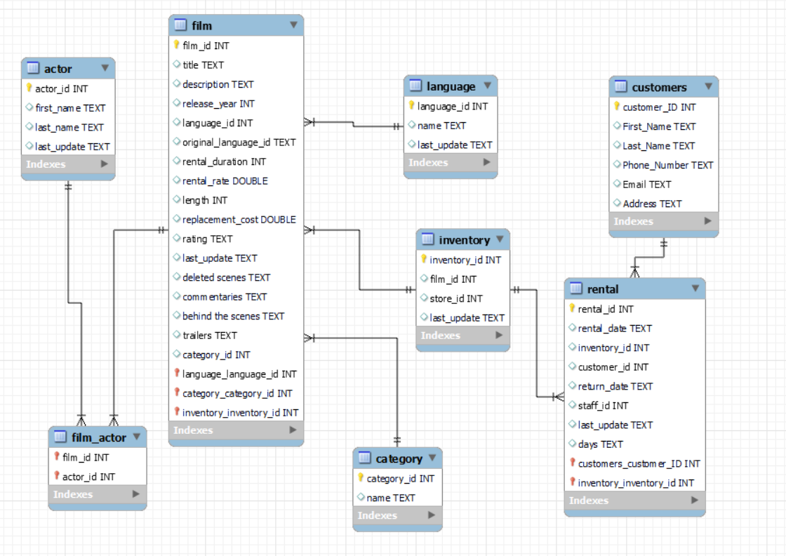

BLOCKBUSTER (PROYECTO SQL) 📼

En la era digital, la industria del entretenimiento ha experimentado una transformación significativa, pero uno de los formatos que ha resistido el paso del tiempo es el cine. Aunque las plataformas de transmisión en línea han ganado popularidad, los videoclubs aún desempeñan un papel vital en la vida de muchos entusiastas del cine. Para optimizar la gestión y operación de un videoclub, es esencial contar con una base de datos sólida y eficiente.

📁 ARCHIVOS:

- Una carpeta "data" con los CSV originales
- Una carpeta "clean_data" con los CSV limpios
- Una carpeta "Notebooks" con los datos de limpieza y creación.
- Dos archivos de texto "creation_query" y "queries" para SQL

🎯 OBJETIVOS:

1º Crear un repositorio en GitHub.

2º Exploración y análisis de los datos para su posterior limpieza.

3º Importar los nuevos archivos con los datos limpios a SQL a través de SQL Workbench.

4º Establecer las relaciones entre las diferentes tablas a través de un diagrama relacional.

5º Encontrar los datos que buscamos a través de consultas específicas.

📈 ANÁLISIS DE LOS DATOS Y LIMPIEZA

Los datos almacenados en los diferentes csv son bastante sólidos, por lo que nos ceñiremos a limpiar nulos, eliminar duplicados y transformar algunas de las columnas para darle más profundida al análisis de los datos, creado nuevas columnas si fuese necesario para almacenar futura información y tener un ecosistema más agradable para reactivar el negocio. Como añadido, generemos una columna que hace alusión a la información de futuros clientes.

🌐 ESTABLECIMIENTO DE LAS RELACIONES

A través de los archivos generados tras la limpieza, importamos los mismos a SQL para establecer las relaciones entre las diferentes tablas. A modo de resumen, las tablas se relacionan de la siguiente manera:

ACTOR [M:M] FILM

LANGUAGE [1:M] FILM

CATEGORY [1:M] FILM

FILM [1:M] CATEGORY

INVENTORY [1:M] RENTAL

RENTAL [1:M] CUSTOMER

El diagrama resultante quedaría así: 

📝 BONUS:

Como bonus, se han realizado varias queries para consultar elementos específicos de las tablas relacionales de cara a analizar las carecterísticas del videoclub previo a su cierre en 2006, en relación a películas, alquileres, clientes...

